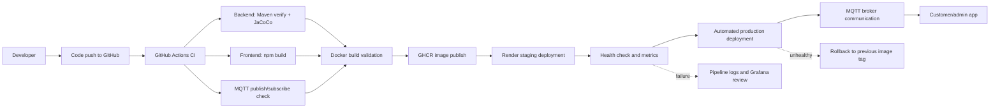
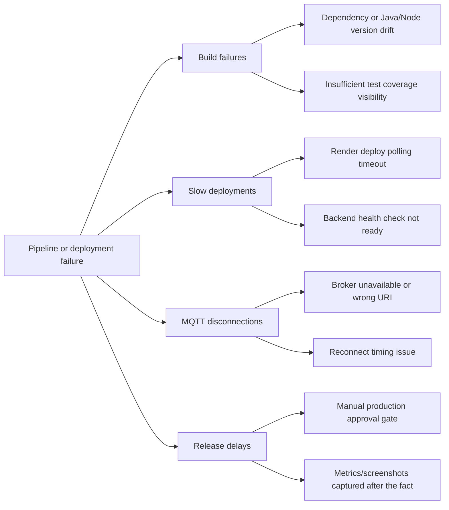

# Process Improvement Analysis and Implementation

## Assignment Checklist

| Requirement | Status | Repository evidence |
| --- | --- | --- |
| Updated CI/CD pipeline | Present | `.github/workflows/ci.yml`, `.github/workflows/cd.yml` |
| Build/test/deploy pipeline | Present | Backend Maven test/build, frontend Vite build, Docker image build, GHCR publish, Render deploy |
| MQTT communication in pipeline | Present | CI MQTT publish/subscribe integration test |
| Logs or screenshots for measurement | Ready for capture | CI uploads metrics artifacts; Grafana dashboard is provisioned in `monitoring/grafana` |
| Implemented improvements | Present | JaCoCo coverage reports, automated production promotion, deployment rollback script |
| Documentation of changes | Present | This document plus `reports/process-metrics-baseline.csv` |
| Process map | Present | Mermaid map below |
| Measurement dashboard/chart | Present | Metric table below and Grafana dashboard config |
| Root cause analysis diagram | Present | Mermaid fishbone-style chart below |
| Improvement plan and before/after results | Present | Improvement section below |
| CMMI maturity assessment | Present | CMMI table below |

## Task 1: Process Map

Manual steps and delays: production approval was previously manual; it is now automated after staging succeeds. Remaining manual work is reviewing Grafana/GitHub screenshots for the final submitted report.

## Task 2: Process Measurement

Baseline values should be replaced with exported GitHub Actions and Grafana values after the next real pipeline runs.

| Metric | Baseline | Target after improvement | Source |
| --- | ---: | ---: | --- |
| Backend build/test time | 120 seconds | 100 seconds or less | GitHub Actions artifact `backend-ci-metrics` |
| Frontend build time | 30 seconds | 25 seconds or less | GitHub Actions artifact `frontend-ci-metrics` |
| Test success rate | 100% local target | 95% or higher | Maven/JUnit output |
| Deployment frequency | On every successful main CI run | Same, with less manual waiting | GitHub Actions CD workflow |
| MQTT message latency | Under 1000 ms target | Under 500 ms | CI artifact `mqtt-ci-metrics` |
| Downtime after deployment | Under 5 minutes target | Under 2 minutes | Render health checks and Grafana |

The operational dashboard is provisioned through Prometheus and Grafana in `monitoring/prometheus.yml` and `monitoring/grafana/provisioning/dashboards/bodaboda-overview.json`.

## Task 3: Root Cause Analysis

Five Whys example for release delays:

| Why | Answer |
| --- | --- |
| Why was production delayed? | The CD workflow waited on a production approval job. |
| Why was approval slow? | A release manager needed to manually approve after staging. |
| Why was the manual gate needed? | There was limited automated evidence that staging was safe. |
| Why was evidence limited? | Coverage, MQTT latency, and build-time artifacts were not captured consistently. |
| Why is the change acceptable now? | CI now records metrics and coverage, and production only starts after staging health checks pass. |

## Task 4: Implemented Improvements

| Improvement | Before | After | Evidence |
| --- | --- | --- | --- |
| Add test coverage reports | Maven ran tests without a coverage artifact | `mvn verify` generates JaCoCo HTML coverage and CI uploads it | `backend/pom.xml`, `.github/workflows/ci.yml` |
| Automate manual approval step | CD required a manual production approval job | Production deploy depends directly on successful staging | `.github/workflows/cd.yml` |
| Add measurable CI artifacts | Metrics were only visible in raw logs | Backend, frontend, and MQTT jobs upload CSV metrics | `.github/workflows/ci.yml` |
| Introduce rollback mechanism | Failed self-hosted deploys ended unhealthy | `PREVIOUS_IMAGE_TAG` can restore the last known-good image | `deployment/scripts/deploy.sh` |

## Task 5: CMMI Maturity Assessment

| CMMI level | Meaning | Bodaboda evidence | Current fit |
| --- | --- | --- | --- |
| Level 1 | Ad hoc builds | Earlier manual approval and incomplete measurement evidence | Historical |
| Level 2 | Managed pipeline | CI builds/tests and CD deploys are defined | Achieved |
| Level 3 | Defined automation | Docker, MQTT checks, staging, production, monitoring, and rollback are documented | Current level |
| Level 4 | Quantitatively managed | Metrics artifacts and Grafana exist, but real trend history must be collected over multiple runs | Next target |
| Level 5 | Optimizing | Continuous improvement based on measured trends | Future target |

Improvement plan to move up one level: run the pipeline at least three times, export GitHub Actions metrics and Grafana screenshots, update `reports/process-metrics-baseline.csv` with real values, and review weekly trends for build time, deployment time, test success rate, MQTT latency, and downtime.

